# SIH26145: passive live monitoring and requirement coverage

## What is implemented

The prototype now processes a continuous local packet-capture stream, runs all six detector families on that stream, emits alerts before capture ends, and saves alerts before notifying the browser. Live monitoring and replay share a single engine session and the same persistent store. Multiple sources, destinations, and attack families can generate alerts in that session.

The original dashboard remains in `ui/`. The simplified dashboard in `ui-simple/` adds **Live monitor**, capture-quality counters, and complete JSON/JSONL alert downloads. The original view continues to receive shared metrics and alerts; use the simplified view for live capture controls.

## Architecture and the one-way constraint

```mermaid
flowchart LR
    A[Monitored link] --> B[Passive mirror / hardware data diode]
    B --> C[Local capture interface]
    C --> D[dumpcap: read-only capture]
    D --> E[Bounded PCAP pipe reader]
    E --> F[Metadata queue]
    F --> G[Flows + all six detector families + models]
    G --> H[JSON-lines ledger + DuckDB index]
    H --> I[Enclave API / dashboard / JSON export]
```



The engine does not open an outbound network client, resolve observed domain names, send probes, complete a handshake, or issue mitigation commands. The capture helper is restricted to enumerated **local** interfaces. Remote RPCAP, TCP capture connections, pipes supplied as interface names, and stdin capture selection are rejected. Subprocess arguments are passed without a shell.

The monitoring host can passively see both directions of an original conversation if the mirror copies both. **One-way ingest is a property of the enclave boundary, not a requirement to discard half of each observed conversation.** When reverse traffic is unavailable, alerts retain incomplete/one-way visibility. Byte ratios and apparent unanswered requests need interpretation in that context.

Software alone cannot prove physical unidirectionality. Deploy the capture interface behind the mirror/data diode; keep the API and operator browser on the separate enclave management network. The prototype does not change host firewall rules or disable an interface’s transmit capability automatically.

## Requirement map

| NTRO requirement | Implementation | Practical limits |
| --- | --- | --- |
| SYN, UDP reflection/amplification, spoofed-source floods | `engine/detect/ddos.py`, `protocol_flood.py`: rates, handshake observations, reflection ratios, source diversity and entropy | Passive source patterns suggest spoofing; they do not authenticate a source. The live preset also enables configurable cold-start rate thresholds. |
| C2 beaconing | `beaconing.py`, `beacon_table.py`: per-channel sessions, inter-arrival statistics, periodicity and regularity | Needs enough history. A stricter live-only branch considers busy sources after at least 32 gaps and 600 seconds. Legitimate scheduled activity can also be periodic. |
| DGA and DNS tunnelling | `dga.py`, `decode/dns.py`: entropy, n-grams, name length, record types and query patterns | DNS must be visible; encrypted DNS content is unavailable. Long or segmented messages may lack complete metadata. |
| Encrypted-session malware indicators | `encrypted.py`, `decode/tls.py`: available TLS fingerprints, packet sizes and timing sequences | No payload decryption. QUIC timing is collected, but this build does not recover encrypted QUIC handshakes or claim a validated QUIC malware classifier. Missing TLS handshakes or segmented ClientHello messages reduce visibility. |
| Reconnaissance/scanning | `scan.py`: source fanout over ports, hosts and time windows | Depends on observation coverage and window/capacity settings. |
| Exfiltration | `exfil.py`: asymmetric volume, transfer shape, destination novelty, sustained ratios | A large upload alone is not proof of exfiltration. Missing reverse traffic and normal backups can confuse the signal. |
| Read-only ingest | `engine/sources/live_source.py`: local dumpcap stdout, plus existing PCAP and flow-CSV replay | No remotely initiated capture path or mitigation channel. Physical isolation is supplied by the deployment. |
| Incremental processing | `api/live.py`: producer + bounded queue + analysis worker; idle ticks close time windows even on quiet links | Window-based detections need observation time. Queue age limits do not establish a universal wire-to-alert deadline. |
| Severity, confidence and evidence | Existing STIX 2.1 indicator schema in `engine/alerts/schema.py` | Rule confidence is not accuracy; new busy-source beacon detections are explicitly uncalibrated. |
| Persistent structured alerts | `api/store.py`: JSON-lines ledger, signatures/hash chain, database index, snapshot exports | Store errors stop analysis instead of silently dropping persistent alerts. Disk capacity and backup policy remain operational responsibilities. |
| Model and validation documentation | `docs/FEATURES.md`, existing training docs, `docs/ACCURACY_IMPROVEMENT_2026-09-08.md`, and the reports below | The earlier candidate training run was not promoted. This task keeps the serving model artifacts unchanged. |

## Start live monitoring on Windows

1. Install Wireshark with Npcap if it is not already installed. On this workstation, the installed capture helper is `C:\Program Files\Wireshark\dumpcap.exe`, and the loopback capture test succeeded.
2. Start the API once from `SIH2026_prototype`: `python -m api.main`. `python app.py` also works for development, but its automatic reload stops active sessions when Python files change.
3. Open **http://127.0.0.1:8000/simple/?mock=0#/live**.
4. Select the interface connected to the passive traffic feed. Wi-Fi captures traffic visible to that adapter; it does not automatically expose every device on the network.
5. Keep filter `ip`, or narrow it with a capture filter such as `host 192.0.2.10` or `tcp port 443`.
6. Choose **Start monitoring**. Watch packet counts, per-class alerts, queue drops, and processing rate. Open **Alerts** to inspect evidence or download records.
7. Choose **Stop monitoring** when finished. A restart requires starting a new session; monitoring does not secretly resume after an API restart.

The live path intentionally captures **IPv4 only**. The existing decoder represents IPv6 as hashed 32-bit identifiers; exposing those as real endpoint addresses would compromise forensic attribution. IPv6 is excluded until full-width address handling is implemented throughout the pipeline. Do not describe this build as complete IPv6 coverage.

`SIH_DUMPCAP` can point to an installed dumpcap executable. Interface/permission errors are shown in the dashboard. No alternate executable or arbitrary command can be chosen through the API. The capture helper uses a 4,096-byte snapshot, an 8 MiB requested kernel buffer, and PCAP framing over stdout. These settings are documented by the [Wireshark dumpcap manual](https://www.wireshark.org/docs/man-pages/dumpcap.html). No raw capture file is written by live mode.

## Saved JSON alerts

- Automatic append-only ledger: **`data/alerts.jsonl`**, or `alerts.jsonl` under `SIH_STATE_DIR` when configured. Each line is a JSON ledger envelope containing the alert under `record` and its chain metadata.
- Query index: **`data/alerts.duckdb`**, or the same name under `SIH_STATE_DIR`.
- Plain JSON array download: **`GET /api/alerts/export?format=json`**.
- Plain JSON-lines download: **`GET /api/alerts/export?format=jsonl`**.
- Optional class filter: append `&threat_class=recon-scanning`, for example.
- The simplified **Alerts** page has **Download JSON** and **Download JSONL** buttons. These export all stored history, independently of the browser’s search/filter and 400-alert display limit.

Exports capture an insertion boundary when the request starts and read records in pages of 100. Alerts arriving later appear in the next export, preventing an endless download while monitoring continues. Empty history produces a valid empty JSON array. Replaying an identical alert does not duplicate the saved record.

Live alerts add capture session, interface, drop counts, and latency basis to `x_detection_context`. The structure also includes timestamps, observed flow, threat class/subtype, severity, score, evidence and model lineage. Saving occurs before the WebSocket notification. The JSON format can be used without the dashboard.

## Capacity and latency

The live preset is **`config/engine-live.json`**. Operator settings supplied through `SIH_ENGINE_CONFIG` override it recursively. The preset uses:

| Resource | Bound/policy |
| --- | --- |
| Active flow table | 50,000 slots; bounded eviction |
| Decoded metadata queue | 4,096 packets |
| Maximum metadata queue age | 2 seconds; older queued observations are discarded and counted |
| Idle watermark allowance | 1 second for capture-helper delivery before advancing a quiet stream |
| Snapshot length | 4,096 bytes per captured packet |
| Requested driver buffer | 8 MiB |
| Beacon assessments | At most 32 ready candidates per tick; remaining candidates stay pending |
| Beacon event-bin work | Existing bounded periodogram budget |
| Model duplicate suppression | Per-subject cooldown with bounded oldest-entry eviction; no global three-alert class quota in the live preset |
| Browser alert/history buffers | 400 alerts / 240 metric updates |
| Notification queue | Existing bounded queue; stored alerts remain recoverable when notifications are shed |
| JSON download memory | 100 stored records per database page |

All six detectors share the same ordered stream; packets are not divided among workers that would lose source/destination history. This is a measured single-node prototype. A multi-host aggregation/sharding system is not delivered or claimed.

The live page reports a trailing processing rate and metadata-ingest-to-saved-alert p99. That measurement includes queue wait, inference, and alert persistence, but excludes driver buffering and the history required to recognize a pattern. A 45-second beacon with 32 required gaps needs roughly 24 minutes of observations. It would be misleading to describe that as a millisecond detection from the first packet.

Queue drops, stale drops, truncation, and timestamp regressions are counted. Driver-level drop counts are **unknown** through this PCAP pipe and are shown as unknown, not zero. Memory pressure or missing data reduces coverage; a zero application-drop counter does not establish lossless capture.

## Validation and measured scope

Reproduce the checks from `SIH2026_prototype`:

```powershell
python -m tools.validate_live_capture --packets 20000 --rate 1000
python bench/live_readiness.py --output bench/live-readiness-final-20260908.json
python -m pytest tests/test_live_monitoring.py -q
```

The first command generates only its own benign UDP exchange between two local loopback sockets; the filter excludes unrelated traffic. It is separate from the detection pipeline and sends nothing to a monitored production network. The second command interleaves the existing capture files offline; it never transmits their attack packets.

| Report | What it verifies |
| --- | --- |
| `bench/live-capture-validation-20260908.json` | Actual Npcap/dumpcap capture of 20,000 local benign packets at a requested 1,000 packets/s; all 20,000 were processed, with zero application queue/stale drops and zero alerts |
| `bench/live-readiness-final-20260908.json` | All 11 captures interleaved into one 105,142-packet stream, all six threat families detected before EOF, JSON persistence/export and a declared 1,000 packets/s offline target |
| `bench/live-false-positives-20260908.json` | Live preset on 25 synthetic benign regression cases, 51,350 packets, zero false alerts observed |

The final mixed-stream run processed **105,142 packets in 43.357 seconds**, averaging **2,425 packets/s (6.856 Mbps)**, and persisted 66 alerts across all six classes. Its slowest complete measurement interval reached **747.76 packets/s**, so it **did not sustain the declared 1,000 packets/s target in every interval**. Processing-to-saved-alert latency was **16.218 ms p50, 99.140 ms p95, and 121.199 ms p99**. This offline latency starts after packet decoding and includes inference and persistence; it excludes capture delivery and the time needed to observe an attack pattern. These are workstation measurements, not guaranteed service levels.

The actual loopback capture test generated its 20,000 benign packets over 20.002 seconds (999.91 packets/s) and processed every packet. Driver-level loss remains unknown. These checks establish prototype behavior on the supplied workload. Class presence in the mixed stream is not precision/recall, the synthetic cases are not independent field data, and a benign loopback load does not establish high-rate mixed-attack performance on a real mirrored link. Full measurements and configuration are retained in the JSON reports.

## Deployment notes

The existing hardened Compose profile intentionally drops capture capabilities and uses isolated container networking. It continues to support replay. It is **not** silently given host networking, elevated privileges, or a transmit path by this change. For live capture, the validated local installation needs access to the intended capture interface. Containerized capture with a separately privileged sensor and a one-way feed needs explicit deployment work and validation.

The gateway now authorizes live start/stop for operator/admin roles and denies viewers those mutations. Dashboard exports remain read operations. The operator/API network must stay separate from the production ingest boundary.

No prototype can promise detection of every attack or zero false positives. Missing encrypted metadata, new attack behavior, IPv6, absent reverse traffic, flow-export formats not implemented by the CSV adapter, capture loss, disk limits, and operational baselines remain material constraints.
